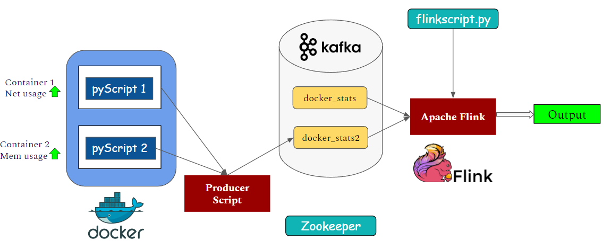
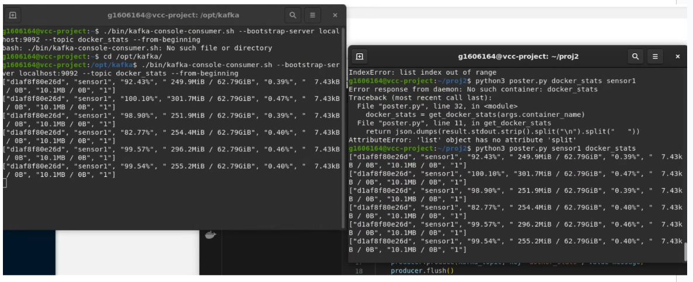
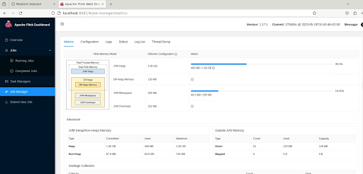

# complex-event-processing-docker-kafka-flink
A software architecture for a complex event processing module has been proposed and implemented for the analysis of data obtained from application virtualization environments.

The repo is a paper implementation of [this paper](https://ieeexplore.ieee.org/document/9179215), where we upscale/downscale physical resources of our containers on the basis of CPU, Memory and Network usage.  

### Architecture:
- Each status data of the containers in Docker technology is obtained in real time via the Docker Engine.
- We use publish-subscribe based messaging bus (Apache Kafka) for transferring the data. When the module detects a pattern and produces a warning, it publishes the warning message to a Kafka topic and transfers it through the Kafka message transmission channel. 
- Consumed stats messages are analysed using Apache Flink, and instructions can be given to the end user to "upscale" or downscale" on the basis of these usages.

 

### Prequisities:
- Installed Java JDK
- Docker Desktop
- Zookeeper & Kafka 2.13
- Flink 1.17.1
- Python packages: confluent_kafka, pyflink, venv
  
### Implementation:

- Clone this github repo and cd into it.
- Docker Containers:
```
cd proj
docker build -t sensor-image .
docker run -d --name sensor1 sensor-image 
```

```
cd ../proj2
docker build -t sensor-image2 .
docker run -d --name sensor2 sensor-image2 
```

- Sensor1: Higher network usage, Sensor2: Higher Memory Usage
- Start zookeeper and kafka
- For Windows (new cmd):
```
.\bin\windows\zookeeper-server-start.bat .\config\zookeeper.properties 
```
New cmd:
```
.\bin\windows\kafka-server-start.bat .\config\server.properties 
```

- For Linux (new terminal):
```
.\bin\zookeeper-server-start.sh .\config\zookeeper.properties
```
New terminal:
```
bin/kafka-server-start.sh config/server.properties

```

- Create topics:
```
kafka-topics.bat --create --bootstrap-server localhost:9092 --topic docker_stats2
kafka-topics.bat --create --bootstrap-server localhost:9092 --topic docker_stats2 
```

- Start Listening:
```
kafka-console-consumer.bat --topic docker_stats --bootstrap-server localhost:9092 --from-beginning  
kafka-console-consumer.bat --topic docker_stats2 --bootstrap-server localhost:9092 --from-beginning  
```

- Start venv (Windows)
```
python -m venv venv
.\venv\Scripts\activate
pip install confluent-kafka
python poster.py sensor1 docker_stats
```

In new cmd:
```
python poster.py sensor1 docker_stats
```



- Start Flink cluster:
```
bin/jobmanager.bat start
```

- Check used resources and jobs in Flink for analytics.


